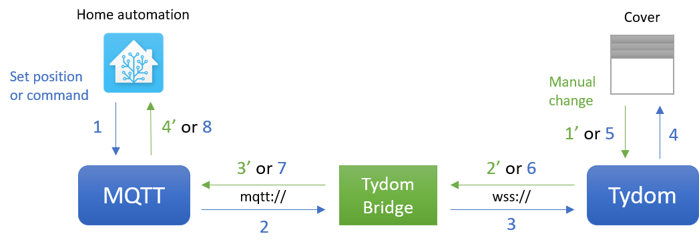

# Overview

This small Node.js project aims at providing a simple bridge between a Tydom 1.0 box and an MQTT server (usually connected to an home automation hub such as Home Assistant).
It also provides a small REST API to play with Tydom box.

For now, it only handles Delta Dore covers and works with both main event types:




# Configuration

## Bridge configuration

The whole configuration is centralized in a config file `config.json`:
```json
{
	"tydom": {
		"mac": "0123456789AB",
		"password": "password",
		"hostname": "192.168.0.XXX"
	},
	"mqtt": {
		"client": {
			"host": "mqtt://192.168.0.YYY",
			"port": 1883,
			"username": "username",
			"password": "password2"
		},
		"topics": {
			"command": "cover/+/set",
			"position": "cover/+/position",
			"position_set": "cover/+/set_position"
		},
		"ha_discovery_prefix": "homeassistant" 
	},
	"devices": {
		"covers": [
			{
				"tydomId": 123456789,
				"localId": "my_cover"
			}
		]
	}
}
```
Sensitive data can also be override by environment variables (indicated in brackets).

### Tydom 
Very simple, it only handles Tydom connection:
- `mac` (`TB_TYDOM_MAC`): Tydom box MAC address, all in majuscules without colon
- `password` (`TB_TYDOM_PASSWORD`): password used in Tydom app
- `hostname` (`TB_TYDOM_HOSTNAME`): local IP or mediation.tydom.com for external use

### MQTT
The client part is for connection information:
- `host` (`TB_MQTT_HOST`): MQTT server hostname or IP (incl. protocol)
- `port`: MQTT server port
- `username` (`TB_MQTT_USERNAME`): (optional) user login
- `password` (`TB_MQTT_PASSWORD`): (optional) user password

In order to make this bridge useable with any MQTT client, the topics can be customized. The `+` caracter corresponds to the cover name:
- `command`: to listen for cover commands (`OPEN` or `CLOSE`) 
- `position`: to send cover position (listening from Tydom box)
- `position_set`: to listen for cover position request, from `0` (close) to `100` open

Finally, Home assistant discovery can be enabled setting the `ha_discovery_prefix` (see [Using discovery](#using-discovery-recommended)).

### Devices
Tydom usually use internal ids for devices which are not convenient for readability in home automation configuration. This configuration enable id mapping to use any name as device id:
- `tydomId`: internal device id for Tydom. The full list can be retrieved using REST API
- `localId`: id used for external systems (must be unique and without space or special chars) 


## Home Assistant configuration

This project can be used with any external system using MQTT but was initially created to connect Tydom box to Home Assistant.

We provide two methods for Home Assistant integration: manual or using discovery.

### Using discovery (recommended) 

This is the recommended method as it will automatically declare new entities in HA.

You just must add to your HA `mqtt` configuration:
```yaml
mqtt:
  discovery: true
  discovery_prefix: homeassistant
```
Of course, the discovery prefix can be changed but it must be the same as the one you declared in `config.json` file (`ha_discovery_prefix`).

### Manual integration

Here is the configuration for Home Assistant to integrate one cover named `office`:
```yaml
cover:
  - platform: mqtt
    name: "Office cover"
    command_topic: "cover/office/set"
    position_topic: "cover/office/position"
    set_position_topic: "cover/office/set_position"
    qos: 0
    retain: true
    payload_open: "OPEN"
    payload_close: "CLOSE"
    position_open: 100
    position_closed: 0
    optimistic: false
    value_template: '{{ value.x }}'
``` 

# Running Tydom bridge

## From sources

This is a simple Node project so you only need Node installed on your computer and you can run the project with the following commands:
```bash
npm i
npm run build
npm start
```

## Using Docker image

This project provides a Docker image available on Docker Hub.

To use id with Docker only:
```bash
docker run  -p 3000:3000 -d -v ./config.json:/usr/src/app/config.json:ro --name tydom-bridge nboissel/tydom-bridge:<version>
```

and with docker-compose:
```yaml
version: '3'
services:
  tydom_bridge:
    container_name: tydom-bridge
    image: nboissel/tydom-bridge:0.5.0
    volumes:
      - ./config.json:/usr/src/app/config.json:ro
```

# Others

## REST API

This project provides 3 routes for now:
- `GET /api/cover/:name` which returns the position for the cover `name`
- `GET /api/covers` which returns the position of all covers
- `PUT /api/cover` with a JSON body providing an id and the position:
	```json
	{
		"id":"office",
		"position": 50
	}
	``` 


## Thanks

This project is heavily inspired by:
- https://github.com/cth35/tydom_python
- https://github.com/mrwiwi/tydom2mqtt

and heavily use https://github.com/mgcrea/node-tydom-client